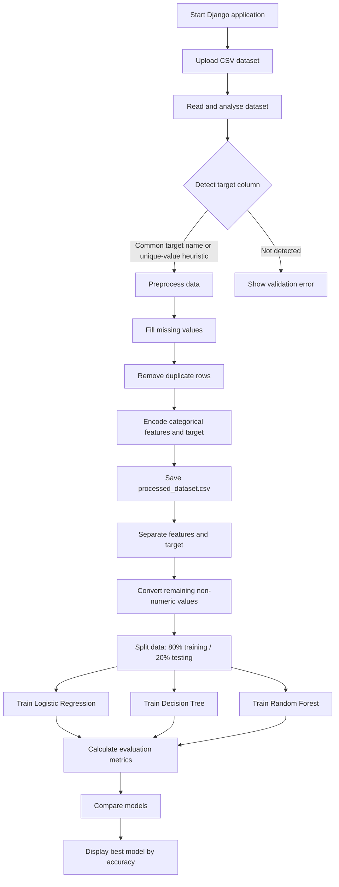

# PSAIAC 230: Predictive Analytics for EdTech Dropout Prevention

## About the Project

This project is an AI-powered predictive analytics platform for identifying online learners who may be at risk of dropping out. It provides a guided workflow for uploading learner data, understanding its structure, preparing it for machine learning, and comparing classification models.

The platform is designed to help educators and learning administrators move from raw student records to evidence-based intervention decisions. It can work with a new CSV dataset as well as the educational datasets included in the repository, provided that the dataset contains a detectable target column.

## Overall Flow



## How It Works

1. **Upload and analyse:** Upload a CSV file from the dashboard. The system records the number of rows and columns, lists column names and data types, counts missing values, and attempts to identify the target column.
2. **Detect the target:** The application first checks common names such as `target`, `dropout`, `status`, `outcome`, and `final_result`. If no common name is found, it searches for a column with between two and ten unique values.
3. **Preprocess:** Numeric missing values are filled with the column median. Non-numeric missing values are filled with the mode or `Unknown`. Duplicate rows are removed, and categorical columns are converted to numeric values.
4. **Train and compare:** The processed data is divided into training and testing sets. Three classification algorithms are trained and evaluated using the same test data.
5. **Review results:** The interface displays each model's accuracy, precision, recall, and weighted F1 score. The model with the highest accuracy is identified as the best-performing model for that run.

## How to Run

### Requirements

- Python 3.10 or later recommended
- Django
- pandas
- NumPy
- scikit-learn

### Setup

```bash
git clone <repository-url>
cd PSAIAC_230_Predictive_Analytics_EdTech_Dropout_Prevention
python -m venv .venv
source .venv/bin/activate       # Linux/macOS
# .venv\\Scripts\\activate      # Windows
pip install -r requirements.txt
python manage.py migrate
python manage.py runserver
```

Open `http://127.0.0.1:8000/` in a browser. Then use the workflow in this order:

1. Upload a CSV dataset at `/`.
2. Open **Data Preprocessing** at `/preprocessing/`.
3. Open **Train Model** at `/model-training/`.

To verify the Django configuration before starting the server:

```bash
python manage.py check
```

## Main Features

- CSV upload validation and dataset analysis
- Automatic target-column detection
- Row, column, data-type, and missing-value summaries
- Median and mode-based missing-value treatment
- Duplicate-row removal
- Categorical feature and target encoding
- Reusable processed dataset output
- 80/20 train-test split with a fixed random state for repeatable comparisons
- Logistic Regression, Decision Tree, and Random Forest training
- Accuracy, precision, recall, and weighted F1 evaluation
- ROC-AUC scores and ROC curve visualizations for model comparison
- Automatic best-model selection by accuracy
- Browser-based Django interface with separate workflow pages

## Challenges Addressed

- **Inconsistent educational data:** Uploaded datasets can contain mixed data types, missing values, duplicate rows, and categorical fields.
- **Unknown target naming:** Different datasets use different names for dropout or outcome labels, so the system uses common-name matching and a unique-value heuristic.
- **Machine-learning input requirements:** Most scikit-learn classifiers require numeric feature values, so text-based features are encoded before training.
- **Fair model comparison:** All models use the same processed data and test split, making the displayed metrics easier to compare.
- **Imbalanced or limited classes:** Weighted metrics and safe handling for single-class stratification reduce common evaluation failures, although the quality of predictions still depends on the dataset.
- **Actionable interpretation:** Reporting several metrics instead of accuracy alone gives users a broader view of model performance.

## Additions and Future Enhancements

The current project establishes the upload, preprocessing, and model-comparison foundation. Potential additions include:

- Save trained models for later prediction instead of retraining on every visit
- Add a dedicated prediction page for individual learner records
- Generate personalized intervention recommendations from risk categories
- Add confusion matrices, ROC-AUC, feature importance, and calibration plots
- Allow users to select the target column and configure preprocessing options manually
- Add cross-validation and hyperparameter tuning
- Handle class imbalance with class weights or resampling methods
- Add authentication, dataset history, audit logs, and role-based access
- Add privacy controls and anonymisation checks for student data
- Export model results and intervention reports
- Add automated tests for uploaded-file validation and edge-case datasets

## What Makes This Different from Other Analytical Models?

This platform is more than a one-off predictive model or a static analytics report:

- **End-to-end workflow:** It combines dataset inspection, cleaning, transformation, training, and comparison in one browser-based process.
- **Dataset flexibility:** It is not tied to one fixed schema; it attempts to adapt to different CSV column names and categorical values.
- **Model benchmarking:** It compares three different classification approaches in the same run rather than presenting a single unexplained score.
- **Education-focused purpose:** The output is intended to support early intervention for learners, not simply classify records after the fact.
- **Transparent preprocessing:** The interface exposes dataset statistics, missing-value changes, duplicates removed, encoded columns, and target mappings.
- **Practical baseline:** The models are lightweight and understandable, making the system suitable as a starting point for an institution-specific predictive pipeline.

The platform should support human decision-making rather than replace educators. Predictions must be reviewed alongside learner context, and sensitive student information should be handled according to institutional privacy requirements.

## Project Structure

```text
config/                 Django project configuration and URL routing
core/                   Application views, machine-learning engine, templates, and tests
data/                   Example, uploaded, and processed CSV datasets
ml/                     Cleaned and model-ready learner data
manage.py               Django command-line entry point
requirements.txt        Python dependencies
```

## Team Information

**Project:** PSAIAC 230 Predictive Analytics EdTech Dropout Prevention<br>
**Repository owner:** Bhoomika (`bhoomicodess`)<br>
**Contributor:** Hena (`Hena757`), Arpitha (`Arpitha`), Annapurna Kb (`Annapurna Kb`)

The project combines responsibilities across data preparation, machine-learning experimentation, Django development, interface design, evaluation, and documentation. Additional team members and their roles can be added here as the project team roster is confirmed.

## Data and Responsible Use

Learner data can contain sensitive personal or educational information. Use anonymised data where possible, restrict access to uploaded files, and avoid using model output as the sole basis for academic or disciplinary decisions. Evaluate performance across relevant student groups before using predictions in practice.
