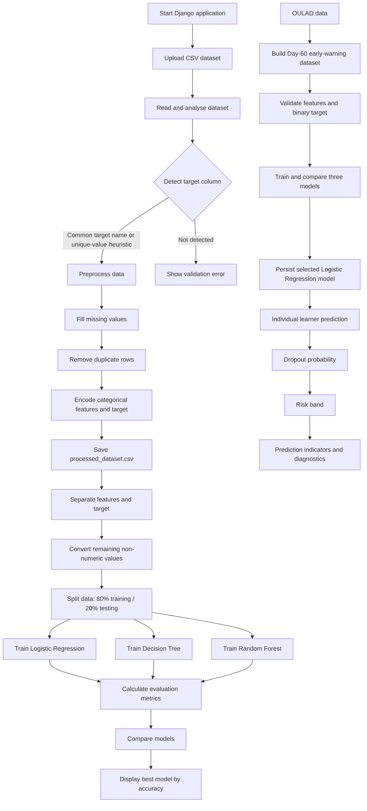

# PSAIAC 230: Predictive Analytics for EdTech Dropout Prevention

## About the Project

This project is an AI-powered predictive analytics platform for identifying online learners who may be at risk of dropping out. It now provides two related workflows: a session-aware generic CSV workflow and a specialized OULAD-based early-warning workflow.

The platform is designed to help educators and learning administrators move from learner records to evidence-based intervention decisions. Prediction is the mechanism; early intervention and dropout prevention are the intended purposes. The system is designed to identify learners who may be at risk early enough to support timely intervention. It does not guarantee dropout prevention and should not replace educator judgment.

## Overall Flow



The generic and specialized workflows are intentionally separate. A generic dataset must be uploaded through the Dashboard before generic preprocessing or model training can use it. The early-warning workflow independently uses the OULAD-derived dataset and persisted early-warning artifacts.

## How It Works

1. **Upload and analyse:** Upload a CSV file from the Dashboard. The current generic dataset is tracked in the browser session and remains available when navigating between the Dashboard, preprocessing, and model-training pages. Existing files on disk are not treated as a new upload by themselves.
2. **Detect the target:** The application first checks common names such as `target`, `dropout`, `status`, `outcome`, and `final_result`. If no common name is found, it searches for a column with between two and ten unique values.
3. **Preprocess:** Numeric missing values are filled with the column median. Non-numeric missing values are filled with the mode or `Unknown`. Duplicate rows are removed, and categorical columns are converted to numeric values.
4. **Train and compare:** The processed data is divided into training and testing sets. Three classification algorithms are trained and evaluated using the same test data.
5. **Review results:** The interface displays each model's accuracy, precision, recall, and weighted F1 score. The model with the highest accuracy is identified as the best-performing model for that run.
6. **Early-warning preparation:** The specialized workflow derives a separate learner-course-presentation table from OULAD using only information available by the Day-60 cutoff. The observed `final_result` is mapped to a binary `dropout` target, while post-cutoff and outcome columns are excluded from predictive inputs.
7. **Early-warning prediction:** Logistic Regression is the selected persisted early-warning model. The individual-prediction page returns a dropout probability, a project-defined risk band, and model-native feature contribution indicators.
8. **Diagnostics:** The early-warning page reports held-out threshold analysis at 0.30, 0.50, and 0.70, including precision, recall, F1, confusion-matrix counts, and ROC-AUC.

### ROC-AUC and ROC Curve

The model-training workflow evaluates classification models using ROC-AUC in addition to Accuracy, Precision, Recall, and weighted F1.

The application also generates and displays a Receiver Operating Characteristic (ROC) curve for models where probability-based evaluation is available.

- ROC stands for **Receiver Operating Characteristic**.
- The ROC curve plots True Positive Rate (Recall/Sensitivity) against False Positive Rate at different classification thresholds.
- ROC-AUC is the Area Under the ROC Curve.
- A higher ROC-AUC generally indicates better ability to distinguish between the two target classes on the evaluated test data.

For the current early-warning model comparison, the measured ROC-AUC values are:

| Model | ROC-AUC |
|---|---:|
| Logistic Regression | 84.93% |
| Decision Tree | 71.90% |
| Random Forest | 81.16% |

These values are calculated on the held-out test set. The ROC curve visualizes classification performance across different probability thresholds. ROC-AUC is not proof that a model will perform equally well on unseen real-world institutional data.

## How to Run

### Requirements

- Python 3.10 or later recommended
- Django
- pandas
- NumPy
- scikit-learn

### Setup

```bash
git clone <repository-url>
cd PSAIAC_230_Predictive_Analytics_EdTech_Dropout_Prevention
python -m venv .venv
source .venv/bin/activate       # Linux/macOS
# .venv\\Scripts\\activate      # Windows
pip install -r requirements.txt
python manage.py migrate
python manage.py runserver
```

Open `http://127.0.0.1:8000/` in a browser. Then use the workflow in this order:

1. Upload a CSV dataset at `/`.
2. Open **Data Preprocessing** at `/preprocessing/`.
3. Open **Train Model** at `/model-training/`.
4. Open **Early-Warning Training** at `/early-warning-training/` to build or inspect the OULAD-based early-warning workflow.
5. Open **Make Predictions** at `/individual-prediction/` to select a learner, course, and presentation and view the persisted early-warning prediction.

The current generic dataset remains active until it is replaced by another upload or explicitly removed from the Dashboard. The specialized early-warning workflow does not require a generic CSV upload.

To verify the Django configuration before starting the server:

```bash
python manage.py check
```

## Main Features

- CSV upload validation and dataset analysis
- Automatic target-column detection
- Row, column, data-type, and missing-value summaries
- Median and mode-based missing-value treatment
- Duplicate-row removal
- Categorical feature and target encoding
- Reusable processed dataset output
- 80/20 train-test split with a fixed random state for repeatable comparisons
- Logistic Regression, Decision Tree, and Random Forest training
- Accuracy, precision, recall, and weighted F1 evaluation
- ROC-AUC scores and ROC curve visualizations for model comparison
- Automatic best-model selection by accuracy
- Session-aware current generic dataset state across workflow pages
- Explicit generic dataset replacement and removal
- OULAD-derived early-warning dataset generation with a Day-60 cutoff
- Leakage validation for early-warning features and binary dropout target
- Persisted early-warning Logistic Regression model and preprocessing artifacts
- Individual learner probability prediction and Low/Medium/High risk bands
- Model-native higher-risk and lower-risk feature contribution indicators
- Held-out early-warning threshold and confusion-matrix diagnostics
- Browser-based Django interface with separate generic and early-warning workflow pages

## Challenges Addressed

- **Inconsistent educational data:** Uploaded datasets can contain mixed data types, missing values, duplicate rows, and categorical fields.
- **Unknown target naming:** Different datasets use different names for dropout or outcome labels, so the system uses common-name matching and a unique-value heuristic.
- **Machine-learning input requirements:** Most scikit-learn classifiers require numeric feature values, so text-based features are encoded before training.
- **Fair model comparison:** All models use the same processed data and test split, making the displayed metrics easier to compare.
- **Imbalanced or limited classes:** Weighted metrics and safe handling for single-class stratification reduce common evaluation failures, although the quality of predictions still depends on the dataset.
- **Actionable interpretation:** Reporting several metrics instead of accuracy alone gives users a broader view of model performance.

## Additions and Future Enhancements

The current project implements the generic CSV workflow and the specialized OULAD early-warning workflow. Potential additions include:

- Generate personalized intervention recommendations from risk categories
- Add calibration plots and richer model-agnostic explainability
- Allow users to select the target column and configure preprocessing options manually
- Add cross-validation and hyperparameter tuning
- Handle class imbalance with class weights or resampling methods
- Add authentication, dataset history, audit logs, and role-based access
- Add privacy controls and anonymisation checks for student data
- Export model results and intervention reports
- Add operational monitoring and institution-specific threshold validation

## What Makes This Different from Other Analytical Models?

This platform is more than a one-off predictive model or a static analytics report:

- **End-to-end workflow:** It combines dataset inspection, cleaning, transformation, training, and comparison in one browser-based process.
- **Dataset flexibility:** It is not tied to one fixed schema; it attempts to adapt to different CSV column names and categorical values.
- **Model benchmarking:** It compares three different classification approaches in the same run rather than presenting a single unexplained score.
- **Education-focused purpose:** The early-warning branch uses a Day-60 cutoff so predictions can support timely intervention rather than simply classify records after the course has ended.
- **Separate data boundaries:** Generic user-uploaded data is kept separate from the specialized OULAD-derived early-warning dataset and its persisted artifacts.
- **Action-oriented output:** Individual predictions include probability, risk band, model indicators, and held-out diagnostic context.
- **Transparent preprocessing:** The interface exposes dataset statistics, missing-value changes, duplicates removed, encoded columns, and target mappings.
- **Practical baseline:** The models are lightweight and understandable, making the system suitable as a starting point for an institution-specific predictive pipeline.

The platform should support human decision-making rather than replace educators. Predictions must be reviewed alongside learner context, and sensitive student information should be handled according to institutional privacy requirements.

## Project Structure

```text
config/                 Django project configuration and URL routing
core/                   Views, ML engine, OULAD feature engineering, early-warning training, templates, and tests
data/                   OULAD source files, generic upload/processed CSVs, early-warning dataset, and artifacts
data/early_warning_artifacts/
                        Persisted early-warning model and preprocessing artifacts
manage.py               Django command-line entry point
requirements.txt        Python dependencies
README.md               Project documentation
```

## Team Information

**Project:** PSAIAC 230 Predictive Analytics EdTech Dropout Prevention<br>
**Repository owner:** Bhoomika (`bhoomicodess`)<br>
**Contributor:** Hena (`Hena757`), Arpitha (`Arpitha`), Annapurna Kb (`Annapurna Kb`)

The project combines responsibilities across data preparation, machine-learning experimentation, Django development, interface design, evaluation, and documentation. Additional team members and their roles can be added here as the project team roster is confirmed.

## Data and Responsible Use

Learner data can contain sensitive personal or educational information. OULAD-derived records include learner and course identifiers, and uploaded CSV files may contain additional personal or educational information. Use anonymised data where possible, restrict access to uploaded files and persisted artifacts, and avoid using model output as the sole basis for academic or disciplinary decisions.

The early-warning target is derived from observed OULAD outcomes:

- `Withdrawn` maps to `dropout = 1`.
- `Pass`, `Fail`, and `Distinction` map to `dropout = 0`.

The target outcome and post-cutoff information must not be treated as early predictive evidence. Evaluate performance across relevant student groups, validate thresholds with domain experts, and provide appropriate human review before using predictions in practice.

## Early-Warning Dataset

The specialized early-warning workflow derives its dataset from the repository's OULAD files. The generated `data/early_warning_dataset.csv` currently contains 32,593 learner-course-presentation records:

- Binary target: `dropout`
  - `Withdrawn` -> `1`
  - `Pass` -> `0`
  - `Fail` -> `0`
  - `Distinction` -> `0`
- Non-dropout: 22,437 records (68.84%)
- Dropout: 10,156 records (31.16%)

The early-warning feature set is:

- `code_module`
- `code_presentation`
- `registration_offset_days`
- `early_assessment_count`
- `early_assessment_score_mean`
- `early_assessment_score_std`
- `early_assessment_scheduled_count`
- `early_assessment_submission_rate`

The feature-construction cutoff is:

```text
ASSESSMENT_CUTOFF_DAY = 60
```

Assessment information after Day 60 is excluded from the early-warning features. The generated table is validated for required columns, unique learner/module/presentation records, numeric early features, binary target values, and absence of `final_result` as a predictive input.

The current 80/20 early-warning split contains 26,074 training rows and 6,519 held-out testing rows. The persisted artifacts are:

- `data/early_warning_artifacts/early_warning_model.joblib`
- `data/early_warning_artifacts/early_warning_preprocessing.joblib`

The project-defined risk bands use a dropout probability below `0.30` for **Low**, `0.30` through below `0.70` for **Medium**, and `0.70` or above for **High**. These thresholds are initial project settings and have not been institutionally or operationally validated.
